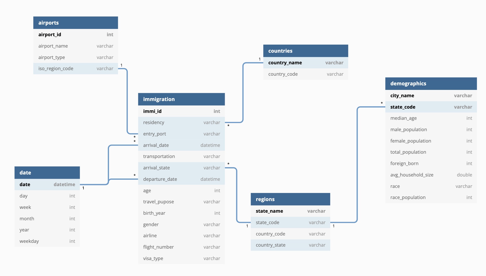

# I94 US Immigration Data Engineering
### Udacity Data Engineering Nanodegree Capstone Project

#### Project Summary
This project creates a data lake for US Immigration data in the year 2016. This data lake will be used for data analytics and BI purpose. Currently data is stored at S3. A data model with star schema will be designed and a ETL pipeline will be built to extract data from S3, clean up using Spark, and load back to S3 with Parquet format. And this processed data could be used to build SQL database.

The project follows the follow steps:
* Step 1: Scope the Project and Gather Data
* Step 2: Explore and Assess the Data
* Step 3: Define the Data Model
* Step 4: Run ETL to Model the Data
* Step 5: Complete Project Write Up

### Step 1: Project Scope and Data Gathering

#### Scope

This project will create a data lake and clean up immigration, airport and demographics data collected from various sources, and load cleaned data back to S3 for a star schema database. This database could be used for data analyst to explore the relation among cities of US, point of entry and immigrant from different countries.

The main tools used in this project are Python, Pandas, Pyspark, SQL, S3, Airflow and Redshift.

#### Data Intro

* [I94 Immigration Data](https://www.trade.gov/national-travel-and-tourism-office): This data comes from the US National Tourism and Trade Office.  

    * Description:  
    Detailed description can be found at [I94_SAS_Labels_Descriptions.SAS](./I94_SAS_Labels_Descriptions.SAS). This file contains descriptions for the I94 meta data. This data contains 12 files for 12 months immigration data in 2016.
    Each file with the size of 500Mb and roughly has 3 million rows.

    * Sample:
 
|         |       cicid |   i94yr |   i94mon |   i94cit |   i94res | i94port   |   arrdate |   i94mode | i94addr   |   depdate |   i94bir |   i94visa |   count |   dtadfile | visapost   |   occup | entdepa   | entdepd   |   entdepu | matflag   |   biryear |   dtaddto | gender   |   insnum | airline   |      admnum |   fltno | visatype   |
|--------:|------------:|--------:|---------:|---------:|---------:|:----------|----------:|----------:|:----------|----------:|---------:|----------:|--------:|-----------:|:-----------|--------:|:----------|:----------|----------:|:----------|----------:|----------:|:---------|---------:|:----------|------------:|--------:|:-----------|
| 1397736 | 2.86358e+06 |    2016 |        4 |      689 |      689 | MIA       |     20559 |         1 | FL        |     20569 |       10 |         2 |       1 |   20160415 | SPL        |     nan | G         | O         |       nan | M         |      2006 |  10142016 | F        |      nan | JJ        | 9.36397e+10 |   08094 | B2         |
|  997880 | 2.03818e+06 |    2016 |        4 |      245 |      245 | SFR       |     20555 |         1 | CA        |     20570 |       50 |         2 |       1 |   20160411 | SHG        |     nan | G         | O         |       nan | M         |      1966 |  10102016 | F        |      nan | MU        | 9.32671e+10 |   00589 | B2         |

* [U.S. City Demographic Data](https://public.opendatasoft.com/explore/dataset/us-cities-demographics/export/)
    * Description:
    This dataset contains information about the demographics of all US cities and census-designated places with a population greater or equal to 65,000. This data comes from the US Census Bureau's 2015 American Community Survey.
    * Sample:

    |      | City         | State      |   Median Age |   Male Population |   Female Population |   Total Population |   Number of Veterans |   Foreign-born |   Average Household Size | State Code   | Race               |   Count |
|-----:|:-------------|:-----------|-------------:|------------------:|--------------------:|-------------------:|---------------------:|---------------:|-------------------------:|:-------------|:-------------------|--------:|
|  629 | Arden-Arcade | California |         41.5 |             47596 |               48680 |              96276 |                 6511 |          13458 |                     2.18 | CA           | White              |   69369 |
| 1438 | Edmond       | Oklahoma   |         32.5 |             45191 |               44899 |              90090 |                 5006 |           5585 |  

* [Airport Code Table](https://datahub.io/core/airport-codes#data)

    * Description:
    This is a simple table of airport codes and corresponding cities.
    * Sample
    
    |       | ident   | type          | name                   |   elevation_ft |   continent | iso_country   | iso_region   | municipality   | gps_code   |   iata_code | local_code   | coordinates                           |
|------:|:--------|:--------------|:-----------------------|---------------:|------------:|:--------------|:-------------|:---------------|:-----------|------------:|:-------------|:--------------------------------------|
|  1613 | 16Z     | seaplane_base | Mc Grath Seaplane Base |            325 |         nan | US            | US-AK        | Mcgrath        | 16Z        |         nan | 16Z          | -155.593002319, 62.9580001831         |
| 10090 | 9NC7    | small_airport | Willow Creek Airport   |            572 |         nan | US            | US-NC        | Mt Pleasant    | 9NC7       |         nan | 9NC7         | -80.44000244140625, 35.36970138549805 |

* [ISO Country Code](https://datahub.io/core/country-list)

    * Description:
    ISO 3166-1-alpha-2 English country names and code elements. This list states the country names (official short names in English) in alphabetical order as given in ISO 3166-1 and the corresponding ISO 3166-1-alpha-2 code elements. [ISO 3166-1].
    * Sample
    
    |     | Name                                         | Code   |
|----:|:---------------------------------------------|:-------|
|   0 | Afghanistan                                  | AF     |
|   1 | Åland Islands                                | AX     |

### Step 2: Explore and Assess the Data
#### 2.1 Explore the Data
Identify data quality issues, like missing values, duplicate data, etc.
#### 2.2 Data Cleaning
Clean and transform data to make sure the data is ready for downstream extract and save.

### Step 3: Define the Data Model
#### 3.1 Conceptual Data Model

The main focus of this project is the immigration and demographics information. It would be natural to build a snowflake schema data model. The immigration and demographics table as the fact tables, and with dimensional tables like time, city, country, and airport.

#### 3.2 Mapping Out Data Pipelines

* Read in configuration settings (dl.cfg);
* Using Spark df to read in raw data from S3, then clean and transformed data, finally select the coresponding data for each fact and dimensional table, and save table data onto S3 for future use.
* Finally, data quality checks are run for each table to validate the output (key columns don't have nulls, record of each table is not 0,etc).

### Step 4: Run Pipelines to Model the Data
#### 4.1 Create the data model
Build the data pipelines to create the data model. (etl.py)

#### 4.2 Data Quality Checks
Data quality checks ensure the pipeline ran as expected. Many of the Quality Checks were perfomed earlier to replace missing values, removing duplicates etc. Another important check is to make sure the primary key of the table is not null and unique before they are written back to S3.

#### 4.3 Data dictionary
Create a data dictionary for the data model. For each field, a brief description of what the data is and where it came from are provided. (capstone.ipynb)

#### Step 5: Complete Project Write Up

#### 5.1 Technology Choice

This project is designed to build a data lake for Analytics and BI teams to research the immigration pattern, country of origin, airlines and its relation with different state's demographics. Creating data lake on S3 seemed appropriate choice, it offers flexibility, efficiency and cost effectiveness. S3 data lake offers a convenient way for data scientist to use the data directly, or as a staging area for data engineers to build dimensional tables for REDSHIFT OR RDS.

Python, Spark framework and Pyspark are appropriate choice for implementation because of the library support. There could be millions of data records for the immigration data every month, to handle this amount of data it is proper to use distributed system like Spark. Besides, with the data growing each month, the need for a distributed system becomes more obvious.

ETL pipeline is scripted with etl.py, it can real immigration SAS files from S3 using spark session and after clean and transform, join with several other data sources, then the results are writen back to S3 in parquet format.

#### 5.2 Data Update

The I94 immigration data could be updated daily, weekly, or monthly, depending on the analytics or BI purpose. If it is research analysis, probably monthly or yearly would be enough. If it is for BI monitoring purpose, it might need to be update daily.

However, other data is relatively more static (airport table, demographics table), they can be updated yearly or even serval year a time.

#### 5.3 Different Scenarios Discussion:

* The data was increased by 100x.

Right now there are around 6 gigabytes of data, and if the data increased by 100x, there would be 600Gb data. It could still be handled with distributed Spark system in EMR. If speed is the concern, the nodes or clusters could be increased easily with EMR.

* The data populates a dashboard that must be updated on a daily basis by 7am every day.

Apache Airflow can be a proper solution for schedueled scripts runs.

* The database needed to be accessed by 100+ people.

Build the database in Redshift could help to provide access for hundreds of people to access the database at the same.
It says that Redshift can handle 500 concurrent connections to a Redshift cluster and maximum 15 queries can be run at the same time in a cluster. If more concurrent queries are needed, redshift provides Concurrency Scaling feature, where you can support virtually unlimited concurrent users and concurrent queries, with consistently fast query performance.
